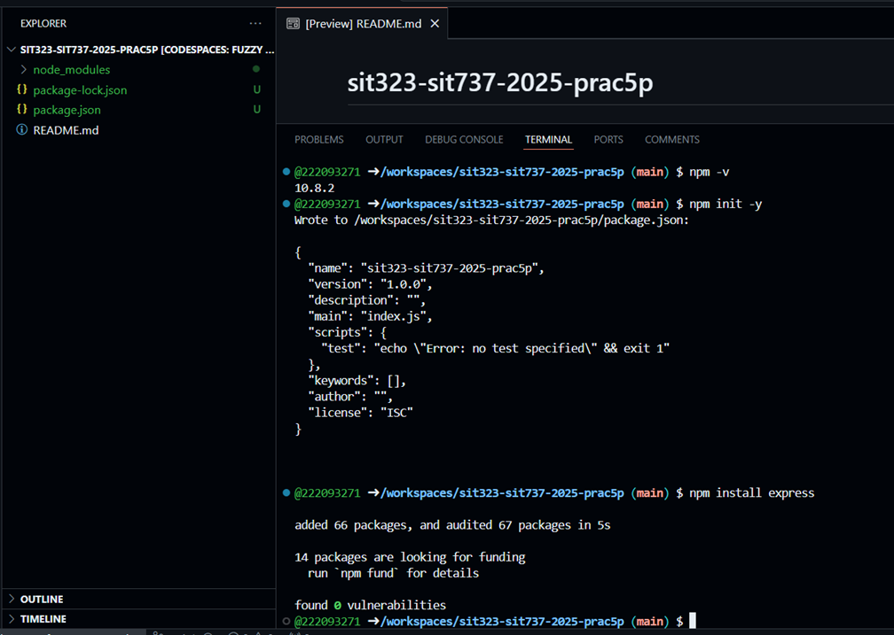
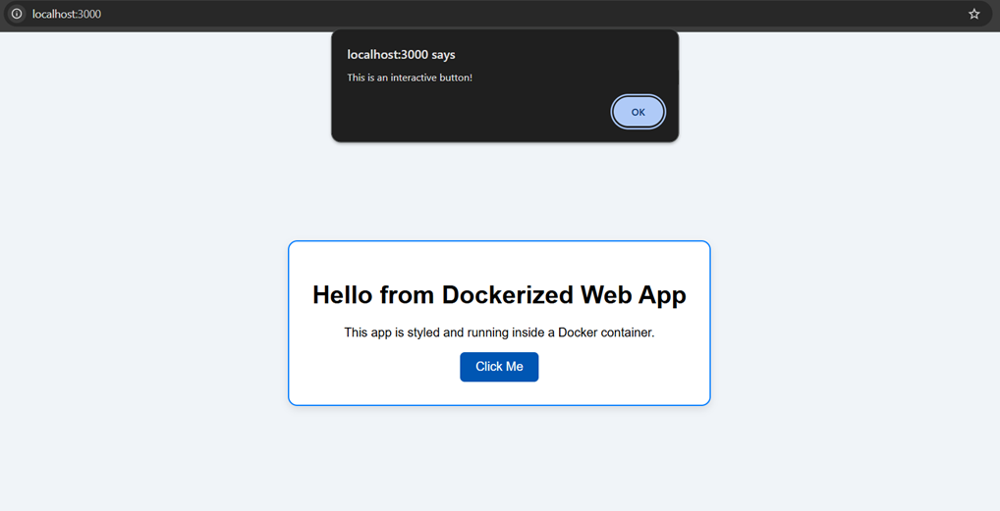
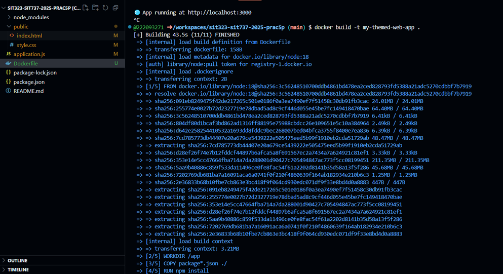
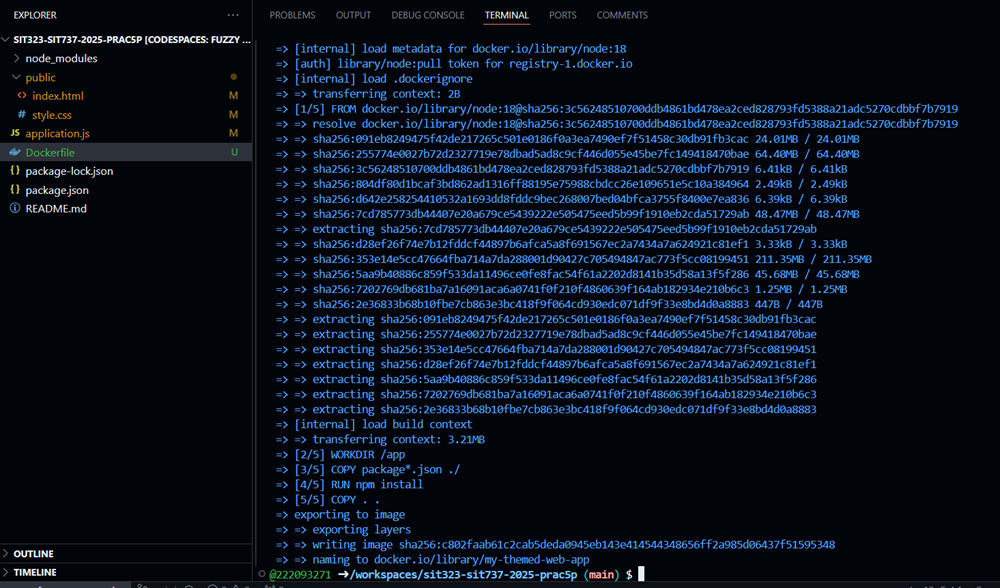
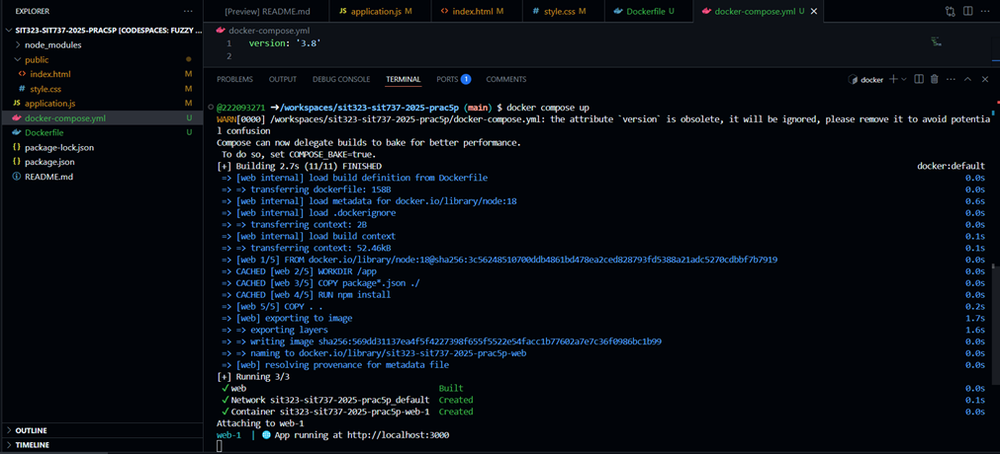
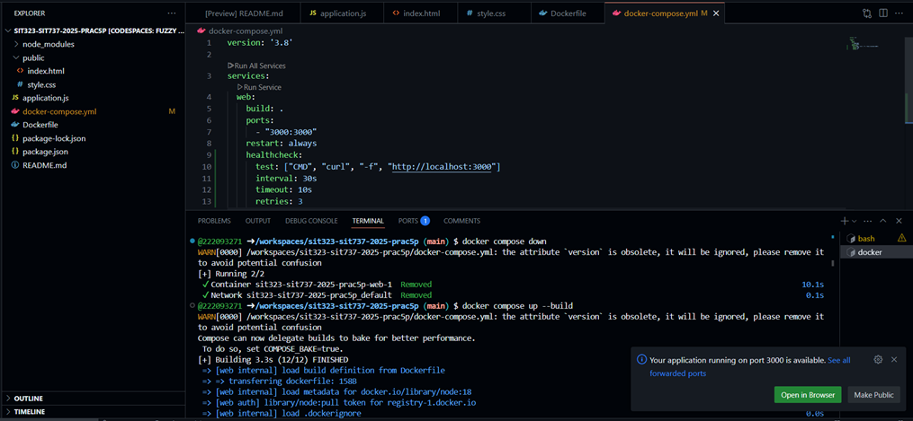
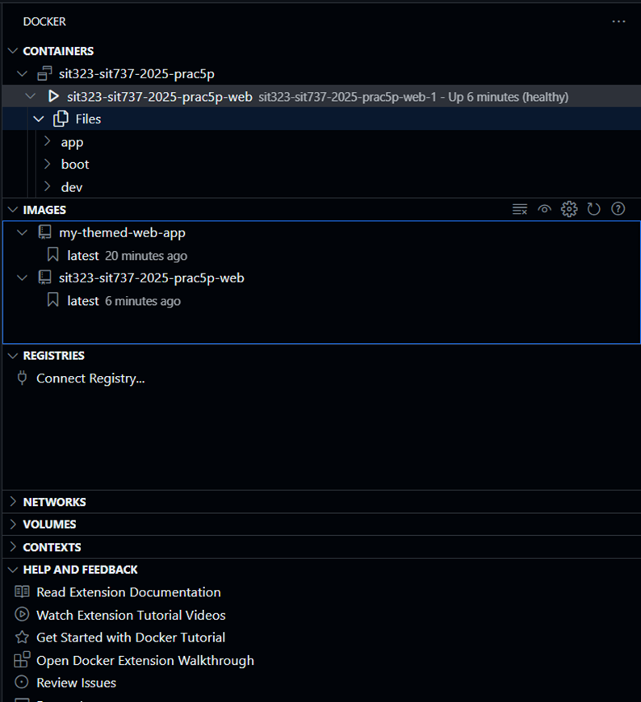
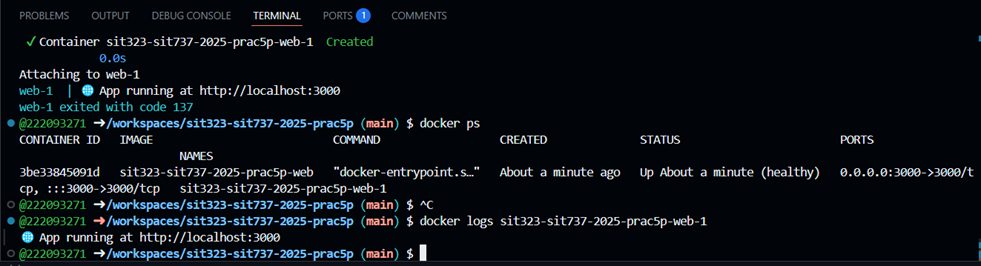

# SIT737-2025-Prac5P – Containerisation of a Simple Web Application Using Docker

### Author: Inwang Ubong Marshal (222093271)

### Repository: https://github.com/222093271/sit323-sit737-2025-prac5p.git 

## Overview 

This documentation details the sequential process followed to achieve the task, which involves containerising a modern and interactive web application using Docker. The task seeks to build a fully functional and styled web application, containerise it into a Docker image, and deploy it with Docker Compose. There is also a health check in place to track the container's health, so the app remains both robust and dependable under real-world operations. The overall solution gets pushed into a GitHub repository to submit.

## Step 1: Installation of Required Tools

To begin, all essential development tools were installed and configured on the system:

•	Node.js – https://nodejs.org/en/download

Enables JavaScript-based server-side development and dependency management using `npm`.

•	Docker Desktop – https://www.docker.com/products/docker-desktop

Allows building, running, and managing containerised applications locally.

•	Visual Studio Code – https://code.visualstudio.com

A popular and powerful code editor is used for developing and organising the project.

•	Git – https://git-scm.com

Used for version control and pushing the project to GitHub.

All installations were verified using command-line version checks.


## Step 2: Project Setup

A new project folder was created and opened in Visual Studio Code under the name: `sit323-sit737-2025-prac5p`

Inside this folder, a new Node.js project was initialised using: `npm init -y`

This generated a `package.json` file to manage the project configuration. Then, the Express library was installed with: `npm install express`

This allowed the creation of a lightweight backend server to serve the frontend files.




## Step 3: Creating the Application Code

The following files were created for the project:

1.	`application.js` – This is the main backend server file.

2.	`public/index.html` – The homepage for the web application.

3.	`public/style.css` – The styling file for the user interface.

The server was configured to host static files from the `public` folder and listen on `3000`. The homepage shows a centrally positioned, styled container with a heading, a message, and an interactive button that causes a JavaScript alert. The button styling involves advanced CSS with padding, border radius, hover effects, and box shadows.

**Purpose**: A more interactive and visually appealing UI illustrates how front-end design becomes integrated with back-end services to present submission as polished and compelling.



**Interface Output Description**: This step creates a running web application at `http://localhost:3000` with a soft background and an alert button styled accordingly. It shows proper design considerations and frontend integration. The interactive alert verifies that JavaScript works properly in the containerised environment.


## Step 4: Creating a Dockerfile

A `Dockerfile` was created to define how the app should be built inside a container: 
```
FROM node:18
WORKDIR /app
COPY package*.json ./
RUN npm install
COPY . .
EXPOSE 3000
CMD ["node", "application.js"]
```

**Explanation**:

*	`FROM node:18` takes Node.js version 18 as its base image

*	`WORKDIR /app` directs the environment to the working directory under /app

*	`COPY` statements copy project files into the container.

*	`RUN npm install` installs project dependencies.

*	`EXPOSE 3000` makes port 3000 accessible externally.

*	`CMD` sets the command to run when the container starts.

This file standardises the environment and provides consistency when deploying anywhere with Docker. 


## Step 5: Building the Docker Image

The Docker image is utilised to bundle the whole application with its environment and dependencies. It will provide consistency across various systems, make deployment easier, and enable the app to run consistently anywhere Docker is supported, giving it portability as well as repeatability.

The Docker image was created with:

```
docker build -t my-themed-web-app .
```

This command builds and packages the app and its dependencies into a reusable image called `my-themed-web-app` by reading from `Dockerfile`.



**Image Build Output Description**:
The image build process output in the terminal verifies that Docker ran all steps outlined in `Dockerfile`. It began by downloading the official Node.js v18 base image from Docker Hub, followed by extracting each layer represented by distinctive `SHA256` hashes. Docker went on to copy `package.json` files, run `npm install` to install project dependencies, and copy the remaining application code into the container. Docker went ahead and pushed the layers and created an image titled `my-themed-web-app`. The following output verifies a clean and accurate image build, guaranteeing portability across environments.


## Step 6: Creating docker-compose.yml

To manage and run the application more efficiently, a docker-compose.yml file was created:

```
version: '3.8'
services:
  web:
    build: .
    ports:
      - "3000:3000"
    restart: always
```

**Explanation**:

*	`build: .` uses the Dockerfile in the current directory.

*	`ports` maps the container’s port to the host’s.

*	`restart: always` ensures the container automatically restarts if it crashes or stops.

This file simplifies launching and managing the application as a service.


## Step 7: Running the App

The application was launched using:

```
docker compose up
```

Once running, it was accessed via browser at:

```
http://localhost:3000
```

The interface loaded successfully, and the interactive button worked as expected.




## Step 8: Adding a Health Check

To guarantee the stability of the container and its restarting if it fails, a health check was introduced in Docker Compose configuration:

```
healthcheck:
  test: ["CMD", "curl", "-f", "http://localhost:3000"]
  interval: 30s
  timeout: 10s
  retries: 3
```

**Functionality**:
The health check also continuously checks if the web app is running successfully every 30 seconds. If the app fails or remains unresponsive, Docker restarts the container. It keeps the app running and accessible, as it should be in a real-world production environment.




## Step 9: Pushing the Project to GitHub

A new GitHub repository named sit737-2025-prac5p was created. The project was pushed using:

```
git init
git remote add origin https://github.com/222093271/sit323-sit737-2025-prac5p.git 
git add .
git commit -m "Containerised styled web app with health check"
git push -u origin main
```

This step ensures version control and enables the project to be shared for submission and collaboration.


## Docker Extension Panel Summary



A VS Code screenshot verifies running container `sit323-sit737-2025-prac5p-web` as healthy and running. The screenshot also indicates available Docker images:

*	`my-themed-web-app` (built manually)

*	`sit323-sit737-2025-prac5p-web` (generated by Compose)

Moreover, its file system appears under "Files", confirming what's running within the Docker environment inside it.


## Container Status Confirmation



Another terminal screenshot displays the container running, its logs outputting the “App running…” line, and its state listed as "healthy". The `docker ps` and `docker logs` commands validate that the app runs successfully and is mapped to port 3000.


## Final Project Summary

This project demonstrates an end-to-end lifecycle of building, deploying, and managing a containerised web application with contemporary technologies. The backend of the application lies in Node.js and Express and handles the server-side functionality and hosts a static, human-readable frontend. The interface of the application consists of clean styling and interactive controls to provide a better user experience and to showcase front-end integration.

With interface and application logic sorted, the project moved into its containerisation phase with Docker. A well-formed `Dockerfile` was created to specify the environment, add its dependencies, and package the application into transportable Docker container form. It enforces environment consistency and avoids common “it works on my machine” deployment issues.

Docker Compose was utilised to organise and manage the container in an efficient manner. It was utilised to create a `docker-compose.yml` file to run and build containers automatically. The containers are made easier to manage with this file, and it becomes more convenient to deploy and restart the application without having to issue complicated commands.

Furthermore, in order to offer reliability with application run, Docker Compose was infused with a health check. The health check constantly verifies readiness by checking if the application remains responsive occasionally. If the container goes unresponsive, Docker will default to restarting it, thereby emulating real-world production readiness and fault tolerance.

Version control was maintained throughout the project with the utilisation of Git, and the finished project—source code, configuration files, and documentation—was pushed into a separate repository in Github.

Overall, the project illustrates an end-to-end flow encompassing:

*	Frontend development (HTML, CSS)

*	Backend development (Node.js, Express)

*	Containerisation (Docker)

*	Service orchestration (Docker Compose)

*	Monitoring and fault recovery (Health Check)

*	Deployment and submission (Git & GitHub)

This project, in addition to fulfilling task requirements, also addresses actual-world software development and deployment procedures and offers real-world experience with relevant DevOps tools and methods.
